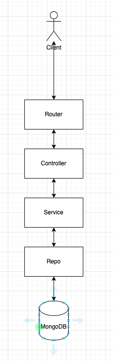

# LineMongo

## Project Purpose
- Collect user messages from Line account
- Send messages to user through Line official account by API

## Demo
- [Youtube](https://www.youtube.com/watch?v=hd-p4-NDxiM)

## Project Installation
- golang version: go 1.19
- install docker daemon first
```bash
# check work dir: ./StockInfoCrawler
cd deployments/
docker-compose up --force-recreate
```

## Project main used libraries
- Go-gin, API
- Go-swagger, provide convenient way to test API.
- mongo-go-driver, operate DataBase.

## project architecture
- 4 Tier architecture




## Contributing
Pull requests are welcome. For major changes, please open an issue first to discuss what you would like to change.
Please make sure to update tests as appropriate.

## License
[MIT](https://choosealicense.com/licenses/mit/)